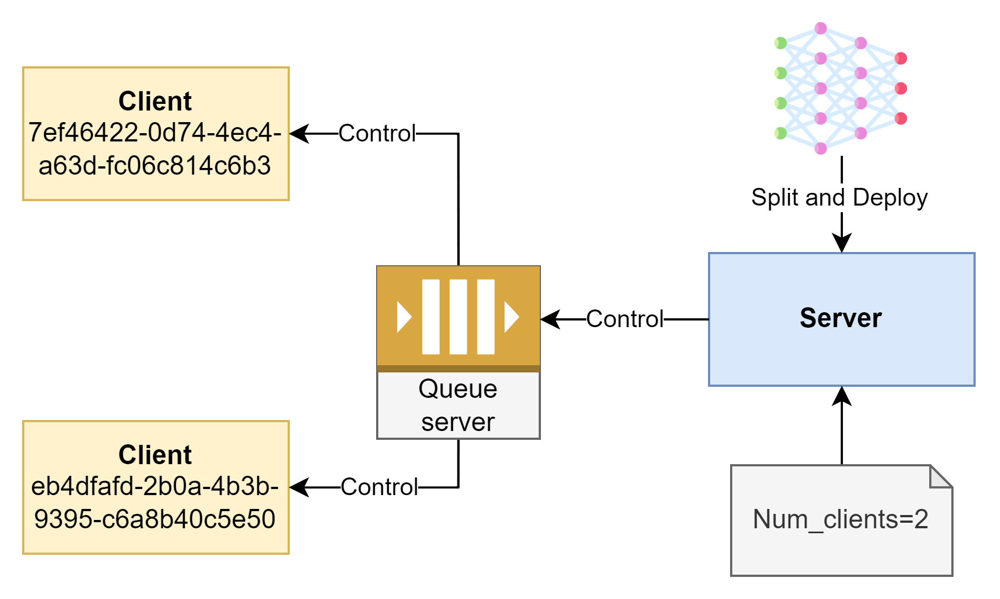

# Coordinated Federated Learning


**Federated Learning** (FL) is a decentralized machine learning approach that enables multiple devices or servers to collaboratively train a model while keeping data localized on each device. Unlike traditional machine learning, where data is centralized in a single location, Federated Learning distributes the training process across devices, ensuring that sensitive or private data remains on users' devices.

Each device processes its data independently to train a local model, sharing only model updates—not raw data—with a central server. The central server then aggregates these updates to improve the global model. This approach enhances privacy, reduces bandwidth consumption, and is especially useful in fields like healthcare, finance, and mobile technology, where data privacy is paramount.

## Key Benefits
- **Enhanced Privacy**: Data stays on the device, reducing privacy concerns.
- **Efficient Bandwidth Use**: Only model updates are shared, minimizing data transfer.
- **Cross-Industry Applicability**: Ideal for industries handling sensitive information, such as healthcare and finance.

Federated Learning represents a significant advancement in privacy-preserving machine learning, allowing secure and collaborative data usage across diverse applications.

## Deployment Model

To deploy the service, each blocks in the system (server and clients) need to ensure the following requirements:
- All must be successfully connected to the same queue server, which serves as the main communication hub for the entire system.
- The server must be correctly configured with the number of clients and the DNN model loaded.



## Required Packages
```
pika
torch
torchvision
numpy
requests
tqdm
pyyaml
scikit-learn
```

Set up a RabbitMQ server for message communication over the network environment. `docker-compose.yaml` file:

```yaml
version: '3'

services:
  rabbitmq:
    image: rabbitmq:management
    container_name: rabbitmq
    ports:
      - "5672:5672"   # RabbitMQ main port
      - "15672:15672" # Management UI
    environment:
      RABBITMQ_DEFAULT_USER: user
      RABBITMQ_DEFAULT_PASS: password
    volumes:
      - rabbitmq_data:/var/lib/rabbitmq
volumes:
  rabbitmq_data:
    driver: local
```

Then run the RabbitMQ container

```commandline
docker-compose up -d
```

## Configuration

Application configuration is in the `config.yaml` file:

```yaml
name: Split Learning
server:   # server configuration
  num-round: 2  # number of training rounds
  clients: 3    # number of FL clients
  filename: resnet_model  # *.pth file name to be saved
  parameters:
    load: False     # allow to load parameters file
    save: False     # allow to save parameters file
                    # if turn on, server will be averaging all parameters
  validation: True  # allow to validate on server-side
  ### algorithm
  data-mode: even         # data distribution evenly
  client-selection: True  # run client selection
  client-cluster: True    # run client cluster

rabbit:   # RabbitMQ connection configuration
  address: 127.0.0.1    # address
  username: admin
  password: admin

log_path: .   # logging directory

learning:
  learning-rate: 0.01
  momentum: 1
  batch-size: 256
```

This configuration is use for server and all clients.

## How to Run

Alter your configuration, you need to run the server to listen and control the request from clients.

### Server

```commandline
python server.py
```

### Client

```commandline
python client.py
```

If using a specific device configuration for the training process, declare it with the `--device` argument when running the command line:

```commandline
python client.py --device cpu
```

## Parameter Files

On the server, the `*.pth` files are saved in the main execution directory of `server.py` after completing one training round.

If the `*.pth` file exists, the server will read the file and send the parameters to the clients. Otherwise, if the file does not exist, a new DNN model will be created with fresh parameters. Therefore, if you want to reset the training process, you should delete the `*.pth` files.

---

Version 1.2.1
